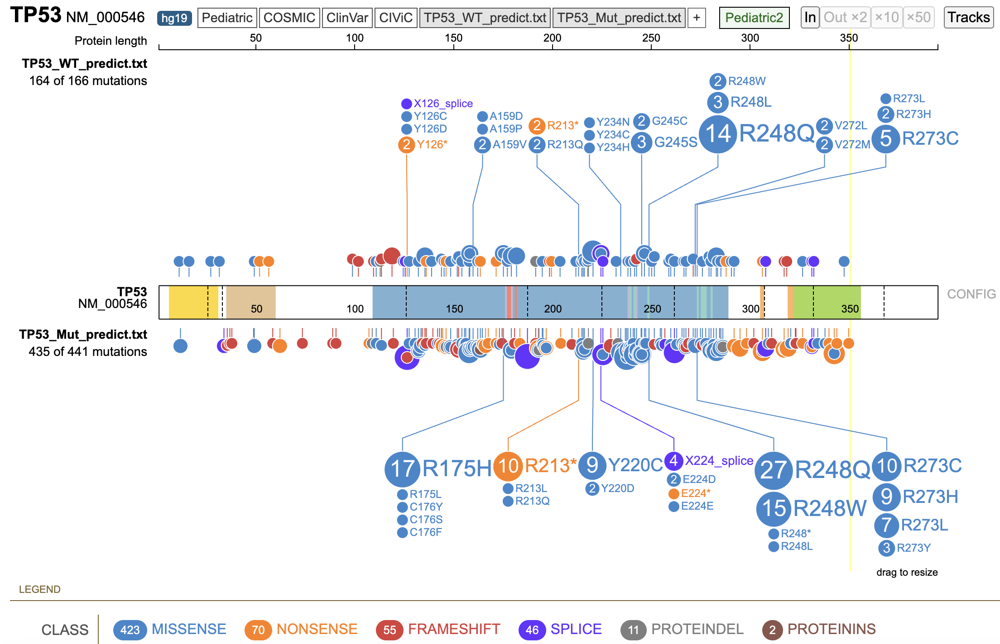

<style type="text/css">

body{ /* Normal  */
      font-size: 16px;
  }
td {  /* Table  */
  font-size: 16px;
}
h1.title {
  font-size: 28px;
  color: DarkRed;
}
h1 { /* Header 1 */
  font-size: 22px;
  color: Black;
}
h2 { /* Header 2 */
    font-size: 20px;
  color: DarkBlue;
}
h3 { /* Header 3 */
  font-size: 16px;
  color: Black;
}
code.r{ /* Code block */
    font-size: 16px;
}
pre { /* Code block - determines code spacing between lines */
    font-size: 16px;
}
</style>

```{r setup, include=FALSE}
knitr::opts_chunk$set(echo = F, warning = F, message = F)
```

# Objectives

TP53 is one of the most well-known gene where its mutations are directly linked to various types of cancers. With mutations observed across the TP53 gene, it is unknown whether a mutation lead to loss-of-function, gain-of-function, or even no impact on the protein functionality. The most orthogonal way to assess p53 functionality is performing specific biological experiments (for example, treatment of nutlin-3, a inhibitor of p53-MDM2, can perturb p53 functions and direct assess p53 functionality in relevant settings). 

However, it is almost impossible to perform such screening for each cell line, in vivo model, and treatment context. Therefore, in the project, I wanted to evaluate whether there is a good p53 signature score that we can utilize to predict p53 functionality from RNA-seq gene expression.

I collected publicly available p53 signature derived through different methodology, and evaluated them utilizing Depmap RNA-seq profiling of over 900 human cell lines. The goal is to identify a p53 signature to infer p53 functionality simply from RNA-seq readouts.


# Summary

* p53 score based on gene expression profile can represent TP53 functionality and is useful for classifying TP53 WT and nonsense/deletion mutations
* p53 score is not only useful for DepMap human cell line data (as shown in the previous notebook) but also in alignment with other publically-available resources such as Alphamissense and OncoKB
* TP53 missense mutations are more difficult to understand in this paradigm due to lack to gold standards to evaluate the performance


## Collection of p53 signatures

Several p53 signatures collection:
  -   Jeay_2015 (Jeay et. al, Elife, 2015)
  -   TCGA_up and TCGA_dn (Donehower et al. Cell Rep, 2019)
  -   Aerts_2016 (Verfaillie et al, Genome Res, 2016)
  -   p53 hallmark gene set


There are 8 genes overlapping the two signatures, Jeay_2015 and TCGA_up


```{r, message=FALSE, warning=FALSE, echo=FALSE, results='hide'}
library(readxl)
library(tidyverse)
library(dplyr)
library(ggpubr)
library(cowplot)
library(pheatmap)

# Load depmap data
Depmap_Model <- read_csv("../data/Reference/Depmap_Model.csv") %>% select(ModelID, StrippedCellLineName)
Depmap_tpm <- read_csv("../data/reference/Depmap_OmicsExpressionProteinCodingGenesTPMLogp1.csv")
# Sort depmap data
rownames(Depmap_tpm) <- Depmap_tpm$...1
Depmap_raw <- Depmap_tpm %>% rownames_to_column(var = "ProfileID") %>% select(!...1) %>% inner_join(Depmap_Model, ., by = c("ModelID" = "ProfileID"))

# Load cell line P53 functional data from 2018 Nat Gen paper from Broad
Data_broad_2018 <- read_excel("../data/Reference/Broad_2018_Supp_Table1.xlsx")
colnames(Data_broad_2018) <- Data_broad_2018[1,]
Data_broad_2018 <- Data_broad_2018 %>% mutate(CellLine = str_replace(CCLE_Cell_Line_Name, "[_].*", ""))

# Subset cell line data shared by Depmap and Broad paper
shared <- intersect(Depmap_raw$StrippedCellLineName, Data_broad_2018$CellLine)
Depmap_filter <- Depmap_raw %>% filter(StrippedCellLineName %in% shared) %>% column_to_rownames(var = "StrippedCellLineName") %>% select(!ModelID) %>% t() %>% data.frame()
rownames(Depmap_filter) <- str_replace(rownames(Depmap_filter), "[ ].*", "")


# Load P53 hallmark
library(GSA)
gs <- list()
hallmark <- GSA.read.gmt("../data/Reference/h.all.v2022.1.Hs.symbols.gmt")
names(hallmark[["genesets"]]) <- hallmark[["geneset.names"]]
gs[["hallmark_P53"]] <- hallmark[["genesets"]][["HALLMARK_P53_PATHWAY"]]
gs[["Sig_Jeay_2015"]] <- c("MDM2", "CDKN1A", "ZMAT3", "DDB2", "FDXR", "RPS27L", "BAX", "RRM2B", "SESN1", "CCNG1", "XPC", "TNFRSF10B", "AEN")
gs[["TCGA_up"]] <- c("SPATA18", "EDA2R", "DDB2", "MDM2", "CDKN2A", "RPS27L", "PHLDA3", "PTCHD4", "FDXR" ,"TNFRSF10C", "ZMAT3", "AEN", "SESN1", "CYFIP2", "CCNG1", "FAS", "BBC3", "GLS2", "GDF15", "TRIM22")
gs[["TCGA_dn"]] <- c("BUB1", "DDIAS", "ERCC6L", "MELK", "AUNIP", "CDC20", "CENPI", "FAM72B", "OIP5", "TPX2", "TTK", "CDCA5", "CDCA8", "CENPA", "DEPDC1", "KIF2C", "NDC80", "PLK1", "POLQ", "SGO1")
gs[["Shared_TCGA_Jeay"]] <- intersect(gs[["TCGA_up"]], gs[["Sig_Jeay_2015"]])
gs[["Setdiff_TCGA_Jeay"]] <- setdiff(gs[["TCGA_up"]], gs[["Sig_Jeay_2015"]])
gs[["Union_TCGA_Jeay"]] <- union(gs[["TCGA_up"]], gs[["Sig_Jeay_2015"]])
 
# Load p53 signature from Genome Res, 2016 from Stein Aerts
Sig_Aerts_2016 <- read_excel("../data/Reference/TP53_signature_Aerts_2016_S5.xlsx") %>% filter(subset == "direct")
gs[["Sig_Aerts_2016"]] <- unique(Sig_Aerts_2016$gene)


# Perfrom ssgsea on all collected p53 signature
library(GSVA)
library(Biobase)
eset <- Biobase::ExpressionSet(as.matrix(Depmap_filter))
ssgsea <- gsva(eset, gset.idx.list = gs, verbose=FALSE)
# ssGSEA score to dataframe combining with TP53 status
score <- Data_broad_2018 %>% 
  select(CellLine, TP53_Mutation_Type_All_Databases, TP53_Mutation_TCGA, TP53_Mutation_CCLE,TP53_Mutation_Sanger_MGH,
         `p53_Target_Genes_Average_Z-score_(Jeay_et_al.)_CCLE`,
         `Functional_Score_(Target_Genes_(CCLE_Z-score)_-_Nutlin-3_(CTD2_Z-score)_-_Nutlin-3_(Sanger_Z-score))`,
         `Nutlin-3_AUC_Z-Score_CTD2`, 
         `Nutlin-3_AUC_Z-Score_Sanger_MGH`) %>%
  inner_join(rownames_to_column(cbind(ssgsea@phenoData@data,t(exprs(ssgsea))), var = "CellLine"), ., by = "CellLine") %>% 
  mutate(TP53_status = ifelse(str_detect(TP53_Mutation_Type_All_Databases,"WT"), "1_WT",
                              ifelse(str_detect(TP53_Mutation_Type_All_Databases,"Deletion"), "3_Nonsense/Del",
                                     ifelse(str_detect(TP53_Mutation_Type_All_Databases,"Nonsense"),
                                            "3_Nonsense/Del", "2_Other_mutation")))) 

# Highlight some models with top score to track them across signatures
top <- score %>% filter(TP53_status == "1_WT") %>% top_n(-20, wt = TCGA_up)
score <- score %>% mutate(top = ifelse(score$CellLine %in% top$CellLine, "Sign", "NotSign"))

```


## Classification and ROC with TCGA_up

## Performance of signatures

Based on the genotype classified in the Broad paper, Jeay_2015 (13 genes) and TCGA_up (20 genes) signature can both classify WT and Nonsense/Del well with AUC > 0.85 for both TP-FP and precision-recall


```{r,fig.height=4, fig.width=12}
# Plot ROC Curve
library(pROC)
library(plotROC)
df <- score %>% filter(TP53_status == "1_WT" | TP53_status == "3_Nonsense/Del") %>% 
  mutate(TP53_mutation = ifelse(TP53_status == "1_WT", 1 ,0))

# Calculate AUC
auc1 <- auc(roc(df$TP53_status, df$Sig_Jeay_2015)) %>% round(., 3)
auc2 <- auc(roc(df$TP53_status, df$TCGA_up)) %>% round(., 3)
ROC <- melt_roc(df, "TP53_mutation", c("Sig_Jeay_2015", "TCGA_up"))

p1 <- ggplot(ROC, aes(d = D, m = M, color = name)) + geom_roc() + style_roc() + ggtitle(paste0("Sig_Jeay_2015 (AUC = ", auc1, ")\n", "Sig_TCGA_up (AUC = ", auc2, ")"))

# Precision-Recall
library(yardstick)
pr1 <- df %>% mutate(TP53_status = as.factor(TP53_status)) %>% 
  pr_curve(., TP53_status, TCGA_up) %>% mutate(name = "TCGA_up")
pr1_auc <- df %>% mutate(TP53_status = as.factor(TP53_status)) %>% 
  pr_auc(., TP53_status, TCGA_up) %>% pull(.estimate) %>% round(.,3)
pr2 <- df %>% mutate(TP53_status = as.factor(TP53_status)) %>% 
  pr_curve(., TP53_status, Sig_Jeay_2015) %>% mutate(name = "Sig_Jeay_2015")
pr2_auc <- df %>% mutate(TP53_status = as.factor(TP53_status)) %>% 
  pr_auc(., TP53_status, Sig_Jeay_2015) %>% pull(.estimate) %>% round(.,3)

p2 <- bind_rows(pr1, pr2) %>% 
  ggplot(., aes(y= precision, x = recall, color = name)) + geom_line() + 
  ggtitle(paste0("Sig_Jeay_2015 (AUC = ", pr2_auc, ")\n", "Sig_TCGA_up (AUC = ", pr1_auc, ")")) + 
  theme_bw()

plot_grid(p1, p2, nrow =1)
```


## Finding threshold in the training data

Further separating the TCGA_up signature does not promote the performance of classification, suggesting using TCGA_up signature score to understand p53 functionality

### Logistic regression model - TCGA_up
```{r,fig.height=6, fig.width=6}
library(pROC)
df <- score %>% filter(TP53_status == "1_WT" | TP53_status == "3_Nonsense/Del") %>% 
  mutate(TP53_mutation = ifelse(TP53_status == "1_WT", 1 ,0))

set.seed(100)
train <- df %>% dplyr::sample_frac(0.7)
test <- df %>% anti_join(., train, by= "CellLine")

# plot logistic regression of trained data
ggplot(train, aes(x = TCGA_up, y = TP53_mutation)) + geom_point() + 
  stat_smooth(method = "glm", method.args = list(family = "binomial"), se = FALSE) + 
  theme_bw() + ggtitle("Training set")

```


```{r,fig.height=4, fig.width=4}

model_train_1 <- glm(TP53_mutation ~ TCGA_up, data = train, family = "binomial")
prob_1 <- predict(model_train_1, test, type = "response")

model_test_1 <- prob_1 %>% data.frame(predict = .) %>% bind_cols(test, .) %>% mutate(TP53_predict = ifelse(predict > 0.6, 1, 0))
FN <- model_test_1 %>% filter(TP53_mutation == 1 & TP53_predict == 0)
FP <- model_test_1 %>% filter(TP53_mutation == 0 & TP53_predict == 1)
TP <- model_test_1 %>% filter(TP53_mutation == 1 & TP53_predict == 1)
TN <- model_test_1 %>% filter(TP53_mutation == 0 & TP53_predict == 0)
# Accuracy
print(paste0("Accurary = ", (nrow(TP) + nrow(TN))/(nrow(TP) + nrow(TN) + nrow(FP) + nrow(FN))))

# Confusion matrix
data.frame(Actual_positive = c(nrow(TP), nrow(FN)), Actual_negative = c(nrow(FP), nrow(TN)), row = c("Predict_positive", "Predict_negative")) %>% column_to_rownames(var = "row")

```


### Logistic regression model - (Shared_TCGA_Jeay + Setdiff_TCGA_Jeay)

```{r,fig.height=4, fig.width=6}
set.seed(100)
model_train_2 <- glm(TP53_mutation ~ Shared_TCGA_Jeay + 
                       Setdiff_TCGA_Jeay, data = train, family = "binomial")
prob_2 <- predict(model_train_2, test, type = "response")

model_test_2 <- prob_2 %>% data.frame(predict = .) %>% bind_cols(test, .) %>% 
  mutate(TP53_predict = ifelse(predict > 0.6, 1, 0))

FN <- model_test_2 %>% filter(TP53_mutation == 1 & TP53_predict == 0)
FP <- model_test_2 %>% filter(TP53_mutation == 0 & TP53_predict == 1)
TP <- model_test_2 %>% filter(TP53_mutation == 1 & TP53_predict == 1)
TN <- model_test_2 %>% filter(TP53_mutation == 0 & TP53_predict == 0)

# Scatter plot
int <- -coef(model_train_2)[1]/coef(model_train_2)[3]
slope <- -coef(model_train_2)[2]/coef(model_train_2)[3]
ggplot(train, aes(x = Shared_TCGA_Jeay, y = Setdiff_TCGA_Jeay)) + theme_bw() +
  geom_point(aes(color = TP53_status)) + geom_abline(intercept = int, slope = slope)

```
  
  
```{r,fig.height=4, fig.width=4}
# Accuracy
print("Accurary")
(nrow(TP) + nrow(TN))/(nrow(TP) + nrow(TN) + nrow(FP) + nrow(FN))
# Confusion matrix
data.frame(Actual_positive = c(nrow(TP), nrow(FN)), Actual_negative = c(nrow(FP), nrow(TN)), row = c("Predict_positive", "Predict_negative")) %>% column_to_rownames(var = "row")

# ROC
ROC <- data.frame(TP53_status = model_test_1$TP53_status, TCGA_up = model_test_1$predict, 
                  `Shared_Setdiff_TCGA_Jeay` = model_test_2$predict) %>% 
  melt_roc(., "TP53_status", c("TCGA_up", "Shared_Setdiff_TCGA_Jeay"))

```


```{r,fig.height=4, fig.width=8}

ggplot(ROC, aes(d = D, m = M, color = name)) + geom_roc() + style_roc() 

```


## Setting threshold TCGA_up = 0

Here, we test the classification by arbitrarily setting a binary threshold to 0 based on the previous ROC plot 

### Separating WT and Nonsense/Deletion
```{r,fig.height=4, fig.width=12}
# Setting threshold TCGA_up = 0
df <- score %>% filter(TP53_status == "1_WT" | TP53_status == "3_Nonsense/Del") %>% mutate(TP53_predict = ifelse(TCGA_up > 0, "1_WT" , "2_Del")) %>% mutate(predict = ifelse(TP53_predict == "1_WT", 1, 0))

TP <- df %>% filter(TP53_status == "1_WT" & TP53_predict == "1_WT")
FP <- df %>% filter(TP53_status == "3_Nonsense/Del" & TP53_predict == "1_WT")
FN <- df %>% filter(TP53_status == "1_WT" & TP53_predict == "2_Del")
TN <- df %>% filter(TP53_status == "3_Nonsense/Del" & TP53_predict == "2_Del")

# Accuracy
print(paste0("Accuracy = ", (nrow(TP) + nrow(TN))/(nrow(TP) + nrow(TN) + nrow(FP) + nrow(FN))))

# Sensitivity
print(paste0("Sensitivity = ", nrow(TP)/(nrow(TP) + nrow(FN))))

# Specificity
print(paste0("Specificity = ", nrow(TN)/(nrow(TN) + nrow(FP))))

# Confusion matrix
data.frame(Actual_positive = c(nrow(TP), nrow(FN)), Actual_negative = c(nrow(FP), nrow(TN)), row = c("Predict_positive", "Predict_negative")) %>% column_to_rownames(var = "row")

```


### Compare prediction and other features
```{r,fig.height=12, fig.width=8}
df <- score %>% filter(TP53_status == "1_WT" | TP53_status == "3_Nonsense/Del") %>% 
  mutate(TP53_predict = ifelse(TCGA_up > 2020.8, "1_WT" , "2_Del")) %>% 
  mutate(predict = ifelse(CellLine %in% TP$CellLine, "TP", 
                          ifelse(CellLine %in% FP$CellLine, "FP", 
                                 ifelse(CellLine %in% FN$CellLine, "FN", "TN")))) %>% 
  left_join(., Data_broad_2018, by = "CellLine")

list <- c("TCGA_up", "Nutlin-3_AUC_Z-Score_CTD2.x", "Nutlin-3_AUC_Z-Score_Sanger_MGH.x", "TP53_Dependency_DEMETER_v2.20.1", "MDM4_Dependency_DEMETER_v2.20.1", "MDM2_Dependency_CERES", "MDM2_mRNA_Expression_Z-Score_CCLE", "CHEK2_Dependency_CERES")

plotlist <- list()
for (i in list){
  plotlist[[i]] <- df %>% mutate(plot = as.numeric(!!sym(i))) %>% 
    ggplot(aes(x= predict, y= plot), color= predict, fill= predict) + 
    geom_boxplot(color = "navyblue", fill = "navyblue", outlier.shape=NA, alpha= 0.5, width = 0.4) + 
    theme_bw() + 
    geom_jitter(position=position_jitter(0.2), cex=1, alpha = 0.5, aes(color = top)) + 
    theme(legend.position = "none", axis.text.x= element_text(size =10), 
          axis.text.y= element_text(size =10), axis.title.x = element_blank(), 
          axis.title.y = element_text(size =10, face= "bold")) + 
    scale_color_manual(values = c("grey20", "red")) + 
    scale_x_discrete(guide = guide_axis(angle = 45)) + ggtitle(i)
}
plot_grid(plotlist = plotlist, ncol = 2)

```


### Correlation of TCGA_up with other features

TCGA_up p53 score is highly positively- and negatively- correlated with many experimental readout to determine p53 functionality

```{r,fig.height=12, fig.width=12}
# Load Depmap wes somatic mutation and cnv data
Depmap_somatic <- read_csv("../data/Reference/Depmap_OmicsSomaticMutations.csv") %>% 
  filter(HugoSymbol == "TP53") %>% 
  select(VariantInfo, ProteinChange, ModelID, LikelyLoF, Driver, LikelyDriver) %>% 
  mutate(ProteinChange = str_replace(ProteinChange, "p.", "")) %>% 
  distinct(ModelID, .keep_all = TRUE) %>% 
  inner_join(Depmap_Model, ., by = c("ModelID" = "ModelID"))

Depmap_cnv <- read_csv("../data/Reference/Depmap_OmicsCNGene.csv") %>% select(`...1`, `TP53 (7157)`)

Depmap_mutation <- Depmap_raw %>% select(ModelID, StrippedCellLineName) %>% 
  left_join(Depmap_cnv, c("ModelID" = "...1")) %>% 
  left_join(Depmap_somatic, c("ModelID"))

# ssgsea for all Depmap cell lines
Depmap_filter <- Depmap_raw %>% column_to_rownames(var = "StrippedCellLineName") %>% 
  select(!ModelID) %>% t() %>% data.frame()
rownames(Depmap_filter) <- str_replace(rownames(Depmap_filter), "[ ].*", "")

eset <- Biobase::ExpressionSet(as.matrix(Depmap_filter))
ssgsea <- gsva(eset, gset.idx.list = gs, verbose=FALSE)

# ssGSEA score to dataframe combining with TP53 status
score_all <- cbind(ssgsea@phenoData@data,t(exprs(ssgsea))) %>% 
  rownames_to_column(var = "ModelID") %>% 
  left_join(Depmap_mutation, c("ModelID" = "StrippedCellLineName.x"))

score_all <- Data_broad_2018 %>% select(!c(CCLE_Cell_Line_Name, 
                                           Genetic_and_Functional_p53_Status, 
                                           TP53_Mutation_Type_All_Databases,
                                           TP53_Mutation_TCGA, TP53_Mutation_CCLE, 
                                           TP53_Mutation_Sanger_MGH)) %>%
  right_join(., score_all, c("CellLine" = "ModelID"))

cor <- list()
df <- score_all %>% select(!c(CellLine, StrippedCellLineName.y, VariantInfo, ProteinChange, 
                              LikelyLoF, LikelyDriver, Driver, ModelID.y))

for (i in colnames(df)){
  df1 <- df %>% select(TCGA_up, i) %>% na.omit()
  cor[[i]] <- cor(pull(df1, TCGA_up), as.numeric(pull(df1, i)))
}

myColor <- colorRampPalette(c("blue", "white", "red"))(200)
data.frame(cor = unlist(cor)) %>% t() %>% data.frame() %>% 
  select(!c(TP53_Log2_Copy_Number_CCLE, TP53..7157.)) %>% 
  select(!any_of(names(gs))) %>% select(!starts_with("Sig")) %>% 
  pheatmap(., cluster_rows = F, cellwidth = 16, cellheight = 16, cluster_cols = F, color = myColor)

```


## Evaluating other mutations

Here, we utilize the binary threshold of TCGA_up = 0 and apply to all other mutations (non WT or nonsense/del) reported from the Broad paper

### Lollipop plot

Distribution of other mutations classified as WT or Mutant p53 functionality

```{r}
df <- score %>% filter(TP53_status != "1_WT") %>% mutate(TP53_predict = ifelse(TCGA_up > 0, "1_WT" , "2_Del"))

WT_predict <- df %>% filter(TP53_predict == "1_WT") %>% pull(CellLine)
Mut_predict <- df %>% filter(TP53_predict == "2_Del") %>% pull(CellLine)
data <- Data_broad_2018 %>% mutate(CellLine = str_replace(CCLE_Cell_Line_Name, "[_].*", "")) 

df1 <- data %>% filter(CellLine %in% WT_predict) %>% 
  select(TP53_Mutation_Type_All_Databases, TP53_Mutation_TCGA, TP53_Mutation_CCLE, TP53_Mutation_Sanger_MGH) %>%
  filter(TP53_Mutation_Type_All_Databases != "Complex_Rearrangement") %>% 
  mutate(class = recode(TP53_Mutation_Type_All_Databases, "Missense_Mutation" = "missense", 
                        "Frame_Shift_Mutation" = "frameshift", "Splice_Site_Mutation" = "splice", 
                        "Frame_Shift_Del" = "frameshift", "Nonsense_Mutation" = "nonsense", 
                        "Frame_Shift_Ins" = "frameshift", "In_Frame_Del" = "proteinDel", 
                        "Homozygous_Deletion" = "nonsense", "In_Frame_Ins" = "proteinIns", 
                        "Frame_Shift" = "frameshift")) %>%
  mutate(gene = "TP53", refseq = "NM_000546", chromosome = "chr17")
#write.csv(df1, "../data/TP53_Mut_predict.csv", row.names = TRUE, col.names = TRUE)

WT_predict <- read.delim("../data/TP53_mutation_WT_predict.txt") %>% 
  mutate(aa_location = substr(aachange, 2, nchar(aachange))) %>% 
  mutate(aa_location = gsub("[a-zA-Z_*].*", "", aa_location)) %>% 
  mutate(aa_location = as.numeric(aa_location))
Mut_predict <- read.delim("../data/TP53_mutation_Mut_predict.txt") %>% 
  mutate(aa_location = substr(aachange, 2, nchar(aachange))) %>% 
  mutate(aa_location = gsub("[a-zA-Z_*].*", "", aa_location)) %>% 
  mutate(aa_location = as.numeric(aa_location))



```

### Type of mutation

Mutation types of other mutations classified as WT or Mutant p53 functionality

```{r}
df <- score %>% filter(TP53_status != "1_WT") %>% 
  mutate(TP53_predict = ifelse(TCGA_up > 0, "1_WT" , "2_Del")) %>% 
  filter(TP53_status == "2_Other_mutation")

aaa <- df %>% filter(TP53_predict == "1_WT") %>% 
  select(TP53_Mutation_Type_All_Databases) %>% 
  mutate(Group = "1_WT")
aaa <- df %>% filter(TP53_predict == "2_Del") %>% 
  select(TP53_Mutation_Type_All_Databases) %>% 
  mutate(Group = "2_Del") %>% bind_rows(., aaa)

ggplot(data_frame("Group" = aaa$Group, "State" = aaa$TP53_Mutation_Type_All_Databases), 
       aes(x = Group, fill= State)) + geom_bar(position="fill") + 
  ylab("Portion of mutations") + theme_bw() + 
  theme(plot.title = element_text(size=22), axis.title.x = element_blank(), 
        axis.title.y = element_text(size = 20), axis.text.x = element_text(size = 16), 
        axis.text.y = element_text(size = 16))

```


### Enrichment statistics

From the previous lollipop plot, we slide the windows (1 to 30 bp) and perfrom Fisher Exact test to determine the significance of odds ratio to understanding whether there are hot spots for other mutations to be classified as WT or Mutation p53 functionality

R175 and R248 seems to be the hot spot for a mutation to be classified as mutant p53 functionality (consistent with AlphaMissense prediction and OncoKB that these mutations are likely loss-of-function and pathogenic)

```{r}
# Statistics for TP53 hot spot mutation
data1 <- Mut_predict %>% filter(class == "missense")
data2 <- WT_predict %>% filter(class == "missense")

hotspot_summary <- data.frame()
for (window in 1:30){
  for (start in (window - window + 1):(350 - window + 1)){
    a <- data1 %>% pull(aa_location) %>% between(., start, (start + window - 1)) %>% which(TRUE) %>% length()
    b <- nrow(data1) - a
    c <- data2 %>% pull(aa_location) %>% between(., start, (start + window - 1)) %>% which(TRUE) %>% length()
    d <- nrow(data2) - c
    count_table <- data.frame("In_hotspot" = c(a, c), 
                              "Not_in_hotspot" = c(b, d), 
                              row = c("Mut_predict", "WT_predict")) %>% 
      column_to_rownames(var = "row")
    p <- fisher.test(count_table, alternative = "two.sided")
    
    temp <- data.frame("Start" = start, "Window" = window,"P" = p$p.value, "logOddsRatio"= log(p$estimate)) %>% filter(P < 0.05)
    hotspot_summary <- bind_rows(hotspot_summary, temp) %>% filter(logOddsRatio != "-Inf" & logOddsRatio != "Inf")
  }
}

top_n(hotspot_summary, -8, wt = P)
top_n(hotspot_summary, -5, wt = Window)
```


## Compare with experimental functional annotation

After understanding at the cell line level, here, we focus on specific protein mutation and the corresponding p53 functional impact

We use the median of the TCGA_up score if multiple cell lines harbor the same mutation


### Fitness screen (Broad paper)

```{r,fig.height=4, fig.width=6}
# Dependency screen from Giacomelli et al. (Broad_2018)
Data_Broad_S3 <- read_excel("../data/Reference/Broad_2018_Supp_Table3.xlsx")
colnames(Data_Broad_S3) <- Data_Broad_S3[1,] 
Data_Broad_S3 <- Data_Broad_S3 %>% 
  select(Allele, Position, Phenotypic_Selection_Model) %>% 
  filter(Allele != "Allele") %>% 
  mutate(Phenotypic_Selection_Model = as.numeric(Phenotypic_Selection_Model))

# plot gsea score vs dependency readout
df <- score %>% mutate(TP53_predict = ifelse(TCGA_up > 0, "1_WT" , "2_Del")) %>% 
  filter(TP53_Mutation_Type_All_Databases == "Missense_Mutation") %>% 
  mutate(aachange = ifelse(!is.na(TP53_Mutation_TCGA), TP53_Mutation_TCGA, 
                           ifelse(!is.na(TP53_Mutation_CCLE), TP53_Mutation_CCLE, TP53_Mutation_Sanger_MGH))) %>% 
  mutate(aachange1 = gsub("[,].*", "", aachange)) %>% 
  mutate(aachange1 = gsub(".*[*|splice]", NA, aachange1)) %>%
  mutate(aachange1 = ifelse(!is.na(aachange1), aachange1, aachange)) %>% 
  mutate(aachange1 = gsub(".*[, ]", "", aachange1)) %>% 
  mutate(aachange1 = gsub("[>]", "", aachange1)) %>% 
  select(-TP53_Mutation_TCGA, -TP53_Mutation_CCLE, -TP53_Mutation_Sanger_MGH, -aachange) %>% 
  group_by(aachange1) %>% summarise(TCGA_up_median = median(TCGA_up)) %>%
  inner_join(., Data_Broad_S3, c("aachange1" = "Allele"))

cor1 <- df %>% select(Phenotypic_Selection_Model, TCGA_up_median) %>% cor(method = "spearman") %>% deframe()

df %>% ggscatter(x = "TCGA_up_median", y = "Phenotypic_Selection_Model", color = "navyblue", 
                 fullrange = TRUE, rug = FALSE, size = 2, alpha=0.7) + 
  ggtitle(paste0("Spearman correlation Rho = ", round(cor1, 3), " (n = ", nrow(df), ")"))

```


### Prime editing screen (Nat Biotech 2024)

```{r,fig.height=4, fig.width=6}
# pegRNA dependency screen from Gould et al. (Nat Biotech_2024)
Data_Gould_D34 <- read_delim("../data/Reference/D34_D4_w_controls.sgrna_summary.txt") %>% 
  filter(FDR < 0.5) %>% group_by(Gene) %>% 
  top_n(-3, wt = FDR) %>% summarise(pegRNA_screen = mean(LFC)) %>% 
  mutate(condition = "No treatment")

Data_Gould_D34_Nut <- read_delim("../data/Reference/D34_NUT_D4_w_controls.sgrna_summary.txt") %>% 
  filter(FDR < 0.5) %>% group_by(Gene) %>% 
  top_n(-3, wt = FDR) %>% 
  summarise(pegRNA_screen = mean(LFC)) %>% mutate(condition = "Nutlin")

# plot gsea score vs pegRNA screen readout
df <- score %>% mutate(TP53_predict = ifelse(TCGA_up > 2020.8, "1_WT" , "2_Del")) %>% 
  filter(TP53_Mutation_Type_All_Databases == "Missense_Mutation") %>% 
  mutate(aachange = ifelse(!is.na(TP53_Mutation_TCGA), TP53_Mutation_TCGA, 
                           ifelse(!is.na(TP53_Mutation_CCLE), TP53_Mutation_CCLE, TP53_Mutation_Sanger_MGH))) %>% 
  mutate(aachange1 = gsub("[,].*", "", aachange)) %>% mutate(aachange1 = gsub(".*[*|splice]", NA, aachange1)) %>%
  mutate(aachange1 = ifelse(!is.na(aachange1), aachange1, aachange)) %>% 
  mutate(aachange1 = gsub(".*[, ]", "", aachange1)) %>% 
  mutate(aachange1 = gsub("[>]", "", aachange1)) %>% 
  select(-TP53_Mutation_TCGA, -TP53_Mutation_CCLE, -TP53_Mutation_Sanger_MGH, -aachange) %>% 
  group_by(aachange1) %>% summarise(TCGA_up_median = median(TCGA_up)) %>%
  inner_join(bind_rows(Data_Gould_D34, Data_Gould_D34_Nut),. , c("Gene" = "aachange1")) 

cor1 <- df %>% filter(condition == "No treatment") %>% 
  select(pegRNA_screen, TCGA_up_median) %>% 
  cor(method = "spearman") %>% deframe()
cor2 <- df %>% filter(condition == "Nutlin") %>% 
  select(pegRNA_screen, TCGA_up_median) %>% 
  cor(method = "spearman") %>% deframe()

df %>% ggscatter(x = "TCGA_up_median", y = "pegRNA_screen", 
                 color = "condition" , fullrange = TRUE, rug = FALSE, size = 2, alpha=0.6, 
                 palette = c("blue", "darkred")) + 
  ggtitle(paste0("Spearman correlation No_treatment = ", 
                 round(cor1, 3), "\n Nutlin = ", round(cor2, 3), 
                 " (n = ", nrow(df), ")"))

```


### AlphaMissense predictions

```{r,fig.height=4, fig.width=6}
library(readr)
# Alpha missense
AlphaMissense <- read_tsv("../data/Reference/AlphaMissense-Search-TP53.tsv") %>% 
  mutate(aachange = paste0(a.a.1, position, a.a.2)) %>% 
  select(aachange, `pathogenicity score`)

df <- score %>% mutate(TP53_predict = ifelse(TCGA_up > 0, "1_WT" , "2_Del")) %>% 
  filter(TP53_Mutation_Type_All_Databases == "Missense_Mutation") %>% 
  mutate(aachange = ifelse(!is.na(TP53_Mutation_TCGA), TP53_Mutation_TCGA, 
                           ifelse(!is.na(TP53_Mutation_CCLE), TP53_Mutation_CCLE, TP53_Mutation_Sanger_MGH))) %>% 
  mutate(aachange1 = gsub("[,].*", "", aachange)) %>% mutate(aachange1 = gsub(".*[*|splice]", NA, aachange1)) %>%
  mutate(aachange1 = ifelse(!is.na(aachange1), aachange1, aachange)) %>% 
  mutate(aachange1 = gsub(".*[, ]", "", aachange1)) %>% 
  mutate(aachange1 = gsub("[>]", "", aachange1)) %>% 
  select(-TP53_Mutation_TCGA, -TP53_Mutation_CCLE, -TP53_Mutation_Sanger_MGH, -aachange) %>% 
  group_by(aachange1) %>% summarise(TCGA_up_median = median(TCGA_up)) %>%
  inner_join(., AlphaMissense , c("aachange1" = "aachange")) 

cor1 <- df %>% select(TCGA_up_median, `pathogenicity score`) %>% cor(method = "spearman") %>% deframe()

df %>% ggscatter(x = "TCGA_up_median", y = "pathogenicity score", 
                 color = "navyblue" , fullrange = TRUE, rug = FALSE, size = 2, alpha=0.6) + 
  ggtitle(paste0("Spearman correlation Rho = ", round(cor1, 3), " (n = ", nrow(df), ")"))

```


### OncoKB annotations
```{r,fig.height=5, fig.width=6}
# OnckKB
OncoKB <- read_csv("../data/Reference/OmicsSomaticMutationsProfileOncobk.csv") %>% filter(HugoSymbol == "TP53")
OncoKB_profile <- read_csv("../data/Reference/OmicsProfiles.csv") %>% 
  left_join(OncoKB, ., by = "ProfileID") %>% 
  left_join(., Depmap_Model, by = "ModelID") %>% 
  select(StrippedCellLineName, MUTATION_EFFECT, ProteinChange) %>% 
  mutate(ProteinChange = gsub("p.", "", ProteinChange)) %>% 
  distinct(ProteinChange, .keep_all = TRUE)


df <- score %>% mutate(TP53_predict = ifelse(TCGA_up > 2020.8, "1_WT" , "2_Del")) %>% 
  filter(TP53_Mutation_Type_All_Databases == "Missense_Mutation") %>% 
  mutate(aachange = ifelse(!is.na(TP53_Mutation_TCGA), TP53_Mutation_TCGA, 
                           ifelse(!is.na(TP53_Mutation_CCLE), TP53_Mutation_CCLE, TP53_Mutation_Sanger_MGH))) %>% 
  mutate(aachange1 = gsub("[,].*", "", aachange)) %>% mutate(aachange1 = gsub(".*[*|splice]", NA, aachange1)) %>%
  mutate(aachange1 = ifelse(!is.na(aachange1), aachange1, aachange)) %>% 
  mutate(aachange1 = gsub(".*[, ]", "", aachange1)) %>% 
  mutate(aachange1 = gsub("[>]", "", aachange1)) %>% 
  select(-TP53_Mutation_TCGA, -TP53_Mutation_CCLE, -TP53_Mutation_Sanger_MGH, -aachange) %>% 
  group_by(aachange1) %>% summarise(TCGA_up_median = median(TCGA_up)) %>%
  inner_join(., OncoKB_profile , c("aachange1" = "ProteinChange")) 

df %>% ggplot(aes(x= MUTATION_EFFECT, y= TCGA_up_median)) + 
  geom_boxplot(color = "navyblue", fill = "navyblue", outlier.shape=NA, alpha= 0.5, width = 0.4) + 
  theme_bw() + 
  geom_jitter(position=position_jitter(0.2), cex=1, alpha = 0.5) + 
  theme(legend.position = "none", axis.text.x= element_text(size =12), 
        axis.text.y= element_text(size =12), axis.title.x = element_blank(), 
        axis.title.y = element_text(size =14, face= "bold")) + 
  scale_x_discrete(guide = guide_axis(angle = 45)) 

```


## Look at all Depmap models (1450 models)

### Performance

```{r,fig.height=4, fig.width=10}
df <- Data_broad_2018 %>% select(CellLine, TP53_Mutation_Type_All_Databases) %>% 
  left_join(score_all, ., c("CellLine" = "CellLine")) %>% 
  mutate(TP53_status = ifelse(str_detect(TP53_Mutation_Type_All_Databases,"WT"), "1_WT",
                              ifelse(str_detect(TP53_Mutation_Type_All_Databases,"Deletion"), "3_Nonsense/Del",
                                     ifelse(str_detect(TP53_Mutation_Type_All_Databases,"Nonsense"), "3_Nonsense/Del", "2_Other_mutation"))))

df_1 <- df[!is.na(df$TP53_status),]
df_2 <- df[is.na(df$TP53_status),] %>% 
  mutate(TP53_status_1 = ifelse(str_detect(VariantInfo, "NONSENSE"), "3_Nonsense/Del", 
                                ifelse(`TP53 (7157)` < 0.5, "3_Nonsense/Del", 
                                       ifelse(is.na(TP53_status), "1_WT", "2_Other_mutation"))))

df_2 <- df[is.na(df$TP53_status),] %>% 
  mutate(TP53_status = ifelse(`TP53 (7157)` < 0.5, "3_Nonsense/Del", 
                              ifelse(str_detect(VariantInfo, "NONSENSE"), "3_Nonsense/Del", "2_Other_mutation"))) %>%
  mutate(TP53_status = ifelse(!is.na(TP53_status), TP53_status, "1_WT")) 
dff <- df_2 %>% select(`TP53 (7157)`, TP53_status, VariantInfo)

score_all <- bind_rows(df_1, df_2)

# function to calculate AUC from statistics of Wilcoxon test
df1 <- score_all %>% filter(TP53_status == "1_WT" | TP53_status == "3_Nonsense/Del")
test <- wilcox.test(TCGA_up ~ TP53_status, data = df1)
n1 <- df1 %>% filter(TP53_status == unique(df1$TP53_status)[[1]]) %>% nrow()
n2 <- df1 %>% filter(TP53_status == unique(df1$TP53_status)[[2]]) %>% nrow()
test$statistic/(n1 * n2)

p1 <- df1 %>% ggplot(aes(x= TP53_status, y= TCGA_up), color= TP53_status, fill= TP53_status) + 
  geom_boxplot(color = "navyblue", fill = "navyblue", outlier.shape=NA, alpha= 0.5, width = 0.4) + 
  theme_bw() + geom_jitter(position=position_jitter(0.2), cex=1, alpha = 0.5) + 
  theme(legend.position = "none", axis.text.x= element_text(size =12), 
        axis.text.y= element_text(size =12), axis.title.x = element_blank(), 
        axis.title.y = element_text(size =14, face= "bold")) + 
  ggtitle("AUC = 0.863")

p2 <- df %>% ggplot(aes(x= TP53_status, y= TCGA_up), color= TP53_status, fill= TP53_status) + 
  geom_boxplot(color = "navyblue", fill = "navyblue", outlier.shape=NA, alpha= 0.5, width = 0.4) + 
  theme_bw() + geom_jitter(position=position_jitter(0.2), cex=1, alpha = 0.5) + 
  theme(legend.position = "none", axis.text.x= element_text(size =12), 
        axis.text.y= element_text(size =12), axis.title.x = element_blank(), 
        axis.title.y = element_text(size =14, face= "bold")) + 
  ggtitle("All mutations identified")

plot_grid(p1, p2, ncol = 2)
```


### Prediction with threshold TCGA_up = 0

```{r,fig.height=4, fig.width=10}
# Setting threshold TCGA_up = 0
df1 <- score_all %>% filter(TP53_status == "1_WT" | TP53_status == "3_Nonsense/Del") %>% 
  mutate(TP53_predict = ifelse(TCGA_up > 0, "1_WT" , "2_Del"))

TP <- df1 %>% filter(TP53_status == "1_WT" & TP53_predict == "1_WT")
FP <- df1 %>% filter(TP53_status == "3_Nonsense/Del" & TP53_predict == "1_WT")
FN <- df1 %>% filter(TP53_status == "1_WT" & TP53_predict == "2_Del")
TN <- df1 %>% filter(TP53_status == "3_Nonsense/Del" & TP53_predict == "2_Del")

# Accuracy
print(paste0("Accuracy = ", (nrow(TP) + nrow(TN))/(nrow(TP) + nrow(TN) + nrow(FP) + nrow(FN))))

# Sensitivity
print(paste0("Sensitivity = ", nrow(TP)/(nrow(TP) + nrow(FN))))

# Specificity
print(paste0("Specificity = ", nrow(TN)/(nrow(TN) + nrow(FP))))

# Confusion matrix
data.frame(Actual_positive = c(nrow(TP), nrow(FN)), Actual_negative = c(nrow(FP), nrow(TN)), row = c("Predict_positive", "Predict_negative")) %>% column_to_rownames(var = "row")

```


### Compare with experimental functional annotation
```{r,fig.height=4, fig.width=6}
# plot gsea score vs dependency readout
df <- score_all %>% mutate(TP53_predict = ifelse(TCGA_up > 2020.8, "1_WT" , "2_Del")) %>% 
  filter(VariantInfo == "MISSENSE" | between(`TP53 (7157)`, 0.8, 1.2)) %>%
  group_by(ProteinChange) %>% summarise(TCGA_up_median = median(TCGA_up)) %>%
  inner_join(., Data_Broad_S3, c("ProteinChange" = "Allele"))
cor1 <- df %>% select(Phenotypic_Selection_Model, TCGA_up_median) %>% cor(method = "spearman") %>% deframe()

df %>% ggscatter(x = "TCGA_up_median", y = "Phenotypic_Selection_Model", 
                 color = "navyblue", fullrange = TRUE, rug = FALSE, size = 2, alpha=0.7) + 
  ggtitle(paste0("Spearman correlation Rho = ", round(cor1, 3), " (n = ", nrow(df), ")"))

```


### Compare with AlphaMissense annotations
```{r,fig.height=4, fig.width=6}
df <- score_all %>% mutate(TP53_predict = ifelse(TCGA_up > 0, "1_WT" , "2_Del")) %>% 
  filter(VariantInfo == "MISSENSE" | between(`TP53 (7157)`, 0.8, 1.2)) %>%
  group_by(ProteinChange) %>% summarise(TCGA_up_median = median(TCGA_up)) %>%
  inner_join(., AlphaMissense , c("ProteinChange" = "aachange")) 

cor1 <- df %>% select(TCGA_up_median, `pathogenicity score`) %>% cor(method = "spearman") %>% deframe()

df %>% ggscatter(x = "TCGA_up_median", y = "pathogenicity score", 
                 color = "navyblue" , fullrange = TRUE, rug = FALSE, size = 2, alpha=0.6) + 
  ggtitle(paste0("Spearman correlation Rho = ", round(cor1, 3)," (n = ", nrow(df), ")"))

```


### Compare experimental screen and AlphaMissense
```{r,fig.height=4, fig.width=6}
df <- score_all %>% mutate(TP53_predict = ifelse(TCGA_up > 0, "1_WT" , "2_Del")) %>% 
  filter(VariantInfo == "MISSENSE" | between(`TP53 (7157)`, 0.8, 1.2)) %>%
  group_by(ProteinChange) %>% summarise(TCGA_up_median = median(TCGA_up)) %>%
  inner_join(., AlphaMissense , c("ProteinChange" = "aachange")) %>% 
  inner_join(., Data_Broad_S3, c("ProteinChange" = "Allele"))

cor1 <- df %>% select(Phenotypic_Selection_Model, `pathogenicity score`) %>% cor(method = "spearman") %>% deframe()

df %>% ggscatter(x = "Phenotypic_Selection_Model", y = "pathogenicity score", 
                 color = "navyblue" , fullrange = TRUE, rug = FALSE, size = 2, alpha=0.6) + 
  ggtitle(paste0("Spearman correlation Rho = ", round(cor1, 3)," (n = ", nrow(df), ")"))

```


