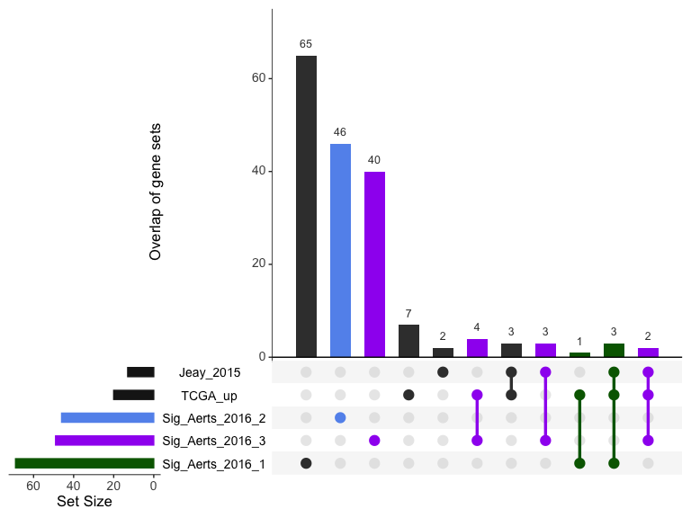
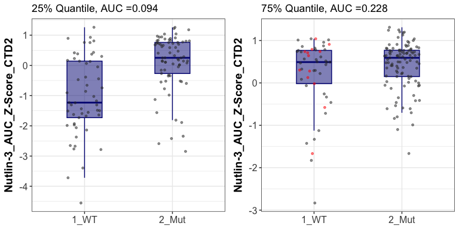

01_TP53_signature_collection
================
Alan Chen

# Objectives

TP53 is one of the most well-known gene where its mutations are directly
linked to various types of cancers. With mutations observed across the
TP53 gene, it is unknown whether a mutation lead to loss-of-function,
gain-of-function, or even no impact on the protein functionality. The
most orthogonal way to assess p53 functionality is performing specific
biological experiments (for example, treatment of nutlin-3, a inhibitor
of p53-MDM2, can perturb p53 functions and direct assess p53
functionality in relevant settings).

However, it is almost impossible to perform such screening for each cell
line, in vivo model, and treatment context. Therefore, in the project, I
wanted to evaluate whether there is a good p53 signature score that we
can utilize to predict p53 functionality from RNA-seq gene expression.

I collected publicly available p53 signature derived through different
methodology, and evaluated them utilizing Depmap RNA-seq profiling of
over 900 human cell lines. The goal is to identify a p53 signature to
infer p53 functionality simply from RNA-seq readouts.

# Summary

- TCGA_up (20 genes) and Jeay_2015 (13 genes) are both good signatures
  indicating p53 functionality through RNA-seq
- There are also other signatures indicating down-regulation of p53
  functionality (eg the TCGA_down 20 genes signature). However, this
  down-regulation score is not adding value to the up-regulation score
- Aerts_2016 paper utilized transcriptional binding to derive the
  p53-bound target genes in the signature. Genes in this signature can
  be clustered into three groups - potentially up-, down-, and
  not-associated

## Collection of p53 signatures

Several p53 signatures collection: - Jeay_2015 (Jeay et. al, Elife,
2015) - TCGA_up and TCGA_dn (Donehower et al. Cell Rep, 2019) -
Aerts_2016 (Verfaillie et al, Genome Res, 2016) - p53 hallmark gene set

There are 8 genes overlapping the two signatures, Jeay_2015 and TCGA_up

## Correlation among signatures

First, I look very broadly at the pearson correlation of the p53
signature collected in all human cell line from Depmap. There are also
experimental functional readout provided by the Broad_2016 paper.

The top two p53 signature, Jeay_2015 and TCGA_up, show a very high
correlation. It is not surprising that p53_hallmark and p53_score_Aerts
show a lower correlation. Because the two gene lists contain a magnitude
higher of genes (150-200 genes), it is likely these gene lists include
redundant signals.

Another good sign is that TCGA_dn show negative correlation with all
other p53 signatures that are associated with up-regulation of p53
functionality. There might be a possibility that we can utilize this
negative correlation to optimize p53 signature (we will explore later).

<!-- -->

### Overlap among p53 gene sets

I wanted to understand the signature a little bit better by looking at
the shared/unique genes in the p53-related gene lists.

From the upset plot, it shows that Jeay_2015 is mostly shared with
TCGA_up (red). In addition, the set difference of Jeay_2015 from TCGA_up
are included in Aerts_2016 and hallmark_p53 (purple). On the other hand,
there are 3 unique genes in TCGA_up, potentially due to the unbiased
searching deriving this signature.

It suggests that all these genes in different signatures are all in a
similar broader set. To evaluate the signature, it is really
differentiating signal-to-noise while trying to prevent over-fitting.

<!-- -->

## Giacomelli et al., Nat Genet., 2019

Relationship between Jeay_ccle signature and functional score as
indicated in the paper (Broad_2016)

- Functional score = Jeay_ccle signature - Nutlin-3_CTD2 -
  Nutlin-3_Sanger_MGH

Both computational gene signature and experimental functional score can
clearly distinguish human cell lines with TP53-wt and TP53-inactive
mutations. I categorized non-wt and non- nonsensene/deletion into all
“other mutation” for now. The anticipation is that these cell lines with
“other TP53 mutation” will show a spectrum of p53 functionality.

Here, the data shows a good first QC step that (1) the signatures are
associated with p53 functionality in diverse contexts and (2) the Depmap
human cell line data set is relavant that can be utlized in this
setting.

<!-- -->

## Comparison between Jeay_2015 and TCGA_up

I dig a little bit deeper for the two signatures, Jeay_2015 and TCGA_up,
since these two signatures have such a high correlation and both perform
well in separating TP53-wt and TP53 nonsense/deletion mutations

### Overlap of gene list

Similar to the previous upset plot, Jeay_2015 and TCGA_up have a high
degree of overlap. It is partially a cause of why the two signatures
show such a high correlation. It is still important to understand the
difference of those genes not shared.

<!-- -->

### Shared and set difference

Based on the venn diagram above, I further separated the gene list into
shared and setdiff.

From the scatter plot visualization, shared gene set and just Jeay_2015
alone perform very good in separating TP53 genotypes. There is still a
decent separation of TP53 genotypes, while it is not as good as shared
gene set and just Jeay_2015 alone. It suggests that there is potentially
still values for this setdiff for the purpose of overfitting.

<!-- -->

## Aerts_2016

This paper Aerts_2016 (Verfaillie et al, Genome Res, 2016) derive its
signature of 171 genes from the role of p53 as a transcriptional factor.
These 171 genes are directly bound (and hypothetically regulated) by
p53.

With the nature of TF-binding, I hypothesized that these genes can be
broadly separated into 3 groups based on the transcriptomic regulation
of p53. There might be gene expressions (1) up-regulated, (2)
down-regulated, and (3) unchanged by p53 binding as a TF.

### Correlation

To test the hypothesis, I created pairs for every two-gene from the
total of 171 genes, and evaluated their correlation across Depmap human
cell lines (regardless of genotype). K-means clustering (with k=3) was
used to classify the pairs based on their correlations. The heatmap is
showing the distance of each pair.

Indeed, there are broadly three clusters identified by the pairwise
correlation. As hypothesized, they are potentially clusters representing
up-regulation, down-regulation, and unchanged gene expression by p53
binding.

In summary, the 171 genes in the Aerts signature can be roughly
clustered in the 3 groups - potentially assigning directionality of -1,
0, 1

<!-- -->

### Overlap

The upset plot indicates the relationship of Jeay_2015 and TCGA_up with
Aerts_signature dividing into 3 clusters based on the previous k-means
classification.

Interestingly, no overlap of Aerts_cluster2 with Jeay_2015 and TCGA_up,
suggesting it is most likely gene where p53 binding least to
down-regulation of gene expression.

Aerts_cluster1 and Aerts_cluster3 both have a degree of overlap with
Jeay_2015 and TCGA_up gene sets. Visually, Aerts_cluster3 has a higher
proportion of overlap compared to Aerts_cluster1. Therefore,
Aerts_cluster3 is most likely where p53 binding least to up-regulation
of gene expression.

This is consistent with the heamp above - large distance between
Aerts_cluster2 and Aerts_cluster3, while Aerts_cluster1 is intermediate
between.

<!-- -->

### Association with other signatures

I compared the 3 subsets from Aerts_2016 with 3 validated gene sets,
TCGA_up, TCGA_dn, and experimental functional score, hypothesizing the 3
subsets are a collection of up-, down-regulation, and no change.

The scatter plot shows that all 3 subsets from Aerts_2016 are actually
all associated with TCGA_up, indicating that the 3 subsets from
Aerts_2016 do not apply to the potential directionality approach.

<!-- -->

### Performance of Aerts_2016 subclustering

The 3 subsets from Aerts_2016 alone also did not perform well in
separating TP53_WT from TP53 nonsense/deletion mutants (with AUC \<0.7
overall), suggesting this gene set derived from TF-binding does not
out-perform other gene set.

Biologically, it is not surprising that TF-binding site is not a good
prediction of gene expression due to the diverse transcriptional
regulation from protein-DNA binding to actually regulate gene
expression.

<!-- -->

# Performance of p53 scores

Similar to above performance evaluation, I look at how good other p53
signatures are in separating P53_WT from TP53 nonsense/deletion mutants.

## p53 score by TP53 genetic status

p53 score of all the potential signatures based on the Depmap cell line
data. AUC is calculated comparing WT and Nonsense/Deletion columns.

As shown above, TCGA_up and Jeay_2015 are the best performer in this
binary classification task (with AUC\>0.85). Simply looking at Setdiff
or Shared gene sets between TCGA_up and Jeay_2015, it does not lead to
better performance in this task.

<!-- -->

## Concordence between signatures

Scatter plot showing the visualized correlation of all the p53
signatures compared so far. TCGA_up and Jeay_2015 are indeed very
similar in binary classification.

While TCGA_dn performs the worst, there is still a trend of negative
correlation with TCGA_up

<!-- -->

Even with the binary categorization of TP53 genotype, it is possible
that other passenger mutations (p53-related or not) can impact p53
functionality. To assess this, I subsetted the Depmap cell lines into
top-25 quantile and bottom-75 quantile to evaluate if there is a
differential responses.

Overall, there’s no striking difference in separating top 25 quantile,
showing that the binary classification based on TP53 genotype is
reasonable.

<!-- -->

<!-- -->

## Testing up- substrating dn- signature

We saw TCGA_dn signature is negatively associated with TCGA_up.
Therefore, I wanted to explore if such negative correlation can benefit
the classification task by increasing the differeces.

ssgsea takes into directionality by using +1 score substracting -1
score. Here, I try to substract TCGA_dn score to see if it achieves a
better AUC

The result shows that this strategy does not lead to a better
performance in terms of binary classification. It is potentially due to
the lower separation of TCGA_dn, and the two signatures might have a
different effects on top- and bottom- performing cell lines. However,
the performance is still pretty good. It might still be interesting if
there is a probelm of generalizability and over-fitting to this dataset.

<!-- -->
