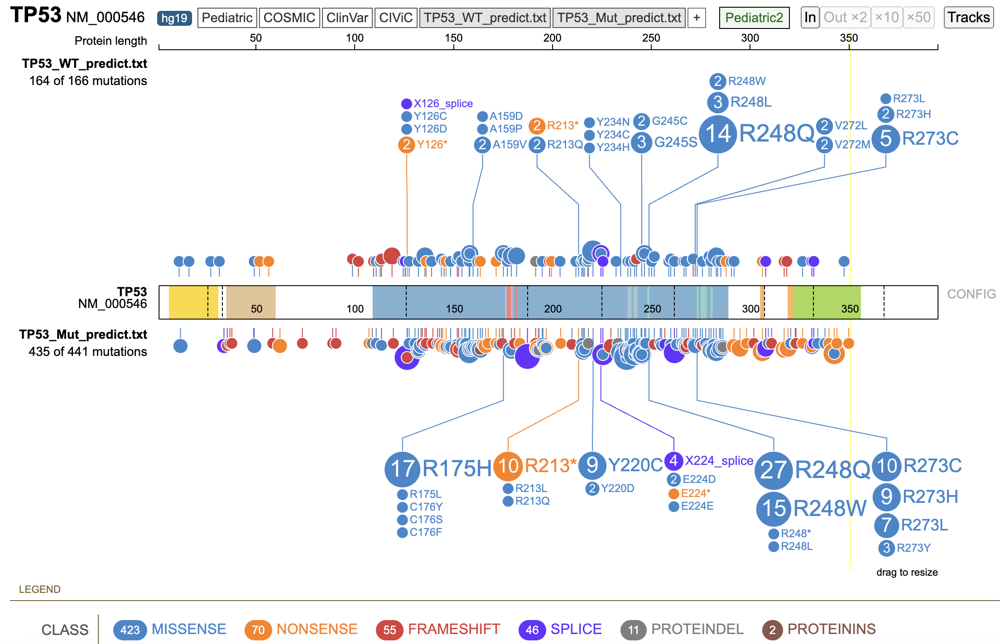

02_TP53_signature_evaluation
================
Alan Chen

# Objectives

TP53 is one of the most well-known gene where its mutations are directly
linked to various types of cancers. With mutations observed across the
TP53 gene, it is unknown whether a mutation lead to loss-of-function,
gain-of-function, or even no impact on the protein functionality. The
most orthogonal way to assess p53 functionality is performing specific
biological experiments (for example, treatment of nutlin-3, a inhibitor
of p53-MDM2, can perturb p53 functions and direct assess p53
functionality in relevant settings).

However, it is almost impossible to perform such screening for each cell
line, in vivo model, and treatment context. Therefore, in the project, I
wanted to evaluate whether there is a good p53 signature score that we
can utilize to predict p53 functionality from RNA-seq gene expression.

I collected publicly available p53 signature derived through different
methodology, and evaluated them utilizing Depmap RNA-seq profiling of
over 900 human cell lines. The goal is to identify a p53 signature to
infer p53 functionality simply from RNA-seq readouts.

# Summary

- p53 score based on gene expression profile can represent TP53
  functionality and is useful for classifying TP53 WT and
  nonsense/deletion mutations
- p53 score is not only useful for DepMap human cell line data (as shown
  in the previous notebook) but also in alignment with other
  publically-available resources such as Alphamissense and OncoKB
- TP53 missense mutations are more difficult to understand in this
  paradigm due to lack to gold standards to evaluate the performance

## Collection of p53 signatures

Several p53 signatures collection: - Jeay_2015 (Jeay et. al, Elife,
2015) - TCGA_up and TCGA_dn (Donehower et al. Cell Rep, 2019) -
Aerts_2016 (Verfaillie et al, Genome Res, 2016) - p53 hallmark gene set

There are 8 genes overlapping the two signatures, Jeay_2015 and TCGA_up

## Classification and ROC with TCGA_up

## Performance of signatures

Based on the genotype classified in the Broad paper, Jeay_2015 (13
genes) and TCGA_up (20 genes) signature can both classify WT and
Nonsense/Del well with AUC \> 0.85 for both TP-FP and precision-recall

<!-- -->

## Finding threshold in the training data

Further separating the TCGA_up signature does not promote the
performance of classification, suggesting using TCGA_up signature score
to understand p53 functionality

### Logistic regression model - TCGA_up

<!-- -->

    ## [1] "Accurary = 0.827586206896552"

    ##                  Actual_positive Actual_negative
    ## Predict_positive              82              11
    ## Predict_negative               9              14

### Logistic regression model - (Shared_TCGA_Jeay + Setdiff_TCGA_Jeay)

<!-- -->

    ## [1] "Accurary"

    ## [1] 0.8362069

    ##                  Actual_positive Actual_negative
    ## Predict_positive              82              10
    ## Predict_negative               9              15

<!-- -->

## Setting threshold TCGA_up = 0

Here, we test the classification by arbitrarily setting a binary
threshold to 0 based on the previous ROC plot

### Separating WT and Nonsense/Deletion

    ## [1] "Accuracy = 0.786082474226804"

    ## [1] "Sensitivity = 0.766773162939297"

    ## [1] "Specificity = 0.866666666666667"

    ##                  Actual_positive Actual_negative
    ## Predict_positive             240              10
    ## Predict_negative              73              65

### Compare prediction and other features

<!-- -->

### Correlation of TCGA_up with other features

TCGA_up p53 score is highly positively- and negatively- correlated with
many experimental readout to determine p53 functionality

<!-- -->

## Evaluating other mutations

Here, we utilize the binary threshold of TCGA_up = 0 and apply to all
other mutations (non WT or nonsense/del) reported from the Broad paper

### Lollipop plot

Distribution of other mutations classified as WT or Mutant p53
functionality

### Type of mutation

Mutation types of other mutations classified as WT or Mutant p53
functionality

<!-- -->

### Enrichment statistics

From the previous lollipop plot, we slide the windows (1 to 30 bp) and
perfrom Fisher Exact test to determine the significance of odds ratio to
understanding whether there are hot spots for other mutations to be
classified as WT or Mutation p53 functionality

R175 and R248 seems to be the hot spot for a mutation to be classified
as mutant p53 functionality (consistent with AlphaMissense prediction
and OncoKB that these mutations are likely loss-of-function and
pathogenic)

    ##                Start Window           P logOddsRatio
    ## odds ratio...1   236      7 0.004893204     1.371557
    ## odds ratio...2   235      8 0.004893204     1.371557
    ## odds ratio...3   236      8 0.004893204     1.371557
    ## odds ratio...4   237      8 0.011534359     1.264961
    ## odds ratio...5   235      9 0.004893204     1.371557
    ## odds ratio...6   236      9 0.004893901     1.405204
    ## odds ratio...7   235     10 0.004893901     1.405204
    ## odds ratio...8   163     13 0.012125362     1.681841
    ## odds ratio...9   162     14 0.012125362     1.681841

    ##                Start Window          P logOddsRatio
    ## odds ratio...1   175      1 0.04621884     1.418509
    ## odds ratio...2   174      2 0.04621884     1.418509
    ## odds ratio...3   250      2 0.03186665    -2.232489
    ## odds ratio...4   173      3 0.03029156     1.476117
    ## odds ratio...5   236      3 0.02850808     1.994154
    ## odds ratio...6   250      3 0.03186665    -2.232489

## Compare with experimental functional annotation

After understanding at the cell line level, here, we focus on specific
protein mutation and the corresponding p53 functional impact

We use the median of the TCGA_up score if multiple cell lines harbor the
same mutation

### Fitness screen (Broad paper)

<!-- -->

### Prime editing screen (Nat Biotech 2024)

<!-- -->

### AlphaMissense predictions

<!-- -->

### OncoKB annotations

<!-- -->

## Look at all Depmap models (1450 models)

### Performance

    ##        W 
    ## 0.869498

<!-- -->

### Prediction with threshold TCGA_up = 0

    ## [1] "Accuracy = 0.765557163531114"

    ## [1] "Sensitivity = 0.740805604203152"

    ## [1] "Specificity = 0.883333333333333"

    ##                  Actual_positive Actual_negative
    ## Predict_positive             423              14
    ## Predict_negative             148             106

### Compare with experimental functional annotation

<!-- -->

### Compare with AlphaMissense annotations

<!-- -->

### Compare experimental screen and AlphaMissense

<!-- -->
